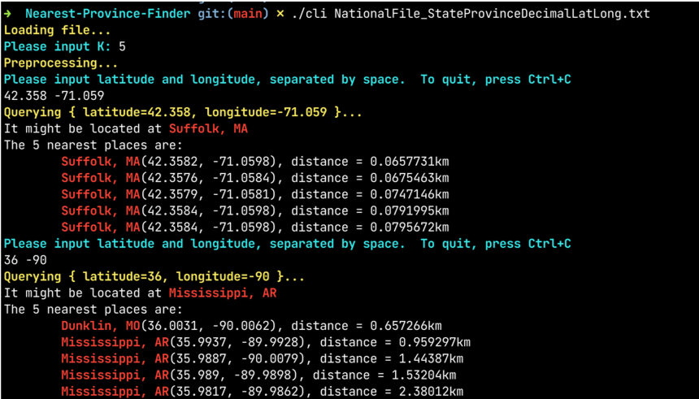

# Nearest Province/County Finder

*final project of EC504*

Jiaqi Zhang, Wenqiang Yang

## Features

- super fast pre-processing and querying
- always gives the accurate K nearest reference points
- easy to use GUI and CLI

## Usage

1. clone the repository by `git clone https://github.com/wq-yang/Nearest-Province-Finder.git`, and go to directory `Nearest-Province-Finder`
1. run command `make` to compile
1. You may need to run `ulimit -s unlimited` so that you can load the whole data to stack memory.
2. run CLI with the input file as its first argument `./cli NationalFile_StateProvinceDecimalLatLong.txt` 
2. Follow the instruction and have fun!

5. To run the GUI, first make sure that `node` and `npm` is all set on your computer. If not, please refer to https://nodejs.org/en/download/current/. You may need to set $PATH variable, like `export PATH=~/node-v17.2.0-linux-x64/bin:$PATH`.
   1. go to directory `gui`
   2. Run `npm i` to install necessary libraries
   3. Run `npm start &`. If it runs successfully, you can visit `localhost:8080` in your browser and will see the map.
6. To make the nearest place finder working, we need to start a backend server.
   1. Go to `services`. If you are at `gui` right now, run `cd ../services`
   2. compile server.cpp by `g++ -std=c++11 -o server -pthread`
   3. run `./server ../NationalFile_StateProvinceDecimalLatLong.txt &`. If no error message promps, the server starts successfully.

7. Now you can visit `localhost:8080` and enjoy fast finding K nearest points! (You may need to zoom in if the nearest points are close to each other)

## Reference and thanks

Thanks to https://github.com/yhirose/cpp-httplib and https://github.com/googlemaps/js-samples. With them make the GUI development much easier.

Our implementation of K-d tree referred a lot to https://oi-wiki.org/ds/kdt/ (Chinese).
